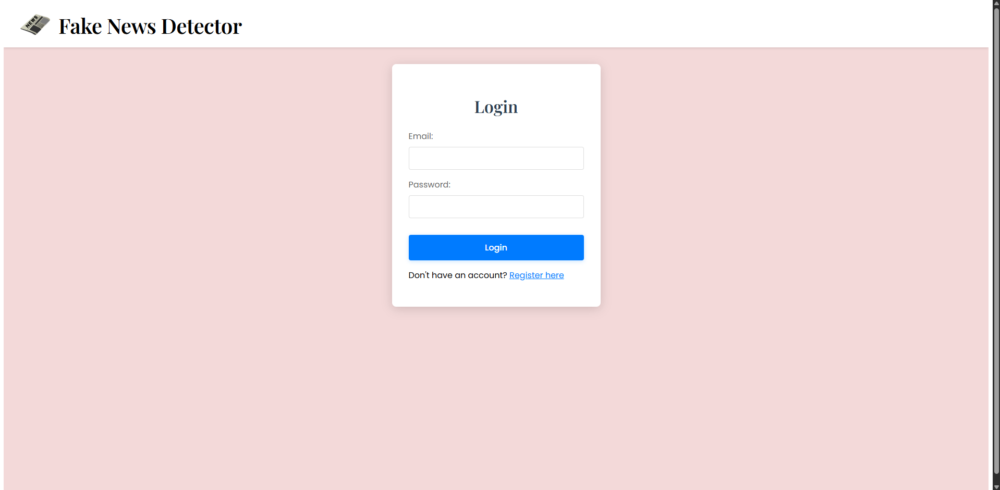
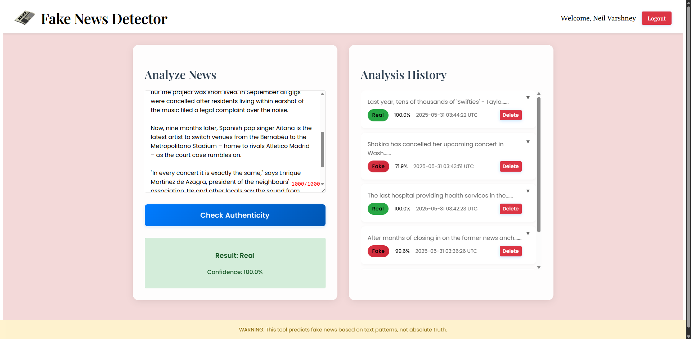
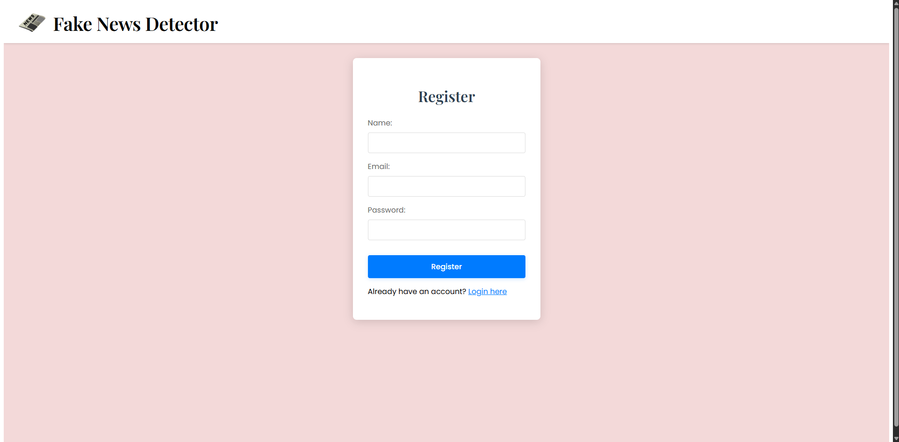

# Fake News Detector

A machine learning-powered web application that helps users identify potentially fake news articles using BERT (Bidirectional Encoder Representations from Transformers) and Logistic Regression. 

## Features

- 🤖 Machine Learning Model: Uses BERT embeddings and Logistic Regression for accurate fake news detection
- 🔐 User Authentication: Secure login and registration system with password hashing
- 📊 Analysis History: Track and review your past news analyses
- 🎯 Confidence Scores: Get probability scores for each prediction
- 📱 Responsive Design: Works seamlessly on both desktop and mobile devices

## Screenshots

### Login Page


### Analysis Page


### Register Page


## Tech Stack

### Frontend
- React.js
- CSS3 with modern features (Flexbox, Grid, Animations)
- Custom fonts (Poppins, Playfair Display)

### Backend
- Flask (Python)
- SQLite Database
- JWT Authentication
- BERT (Hugging Face Transformers)
- Scikit-learn

## Prerequisites

- Python 3.8+
- Node.js 14+
- npm or yarn
- CUDA-capable GPU (recommended for faster BERT processing)

## Installation

1. Clone the repository:
```bash
git clone https://github.com/yourusername/fake-news-detector.git
cd fake-news-detector
```

2. Set up the backend:
```bash
cd backend
python -m venv venv
source venv/bin/activate  # On Windows: venv\Scripts\activate
pip install -r requirements.txt
```

3. Download the dataset:
   - Go to [Kaggle Fake and Real News Dataset](https://www.kaggle.com/datasets/clmentbisaillon/fake-and-real-news-dataset)
   - Download the dataset
   - Extract the following files to the `backend` directory:
     - `True.csv`
     - `Fake.csv`

4. Train the model:
```bash
python model.py
```

5. Set up the frontend:
```bash
cd ../frontend
npm install
```

## Configuration

1. Create a `.env` file in the backend directory:
```
JWT_SECRET_KEY=your-secret-key-here
```

2. Update the database configuration in `backend/app.py` if needed.

## Running the Application

1. Start the backend server:
```bash
cd backend
python app.py
```

2. In a new terminal, start the frontend:
```bash
cd frontend
npm start
```

The application will be available at:
- Frontend: http://localhost:3000
- Backend API: http://localhost:5000

## Usage

1. Register a new account or login with existing credentials
2. Paste a short  news article text into the analysis section
3. Click "Check Authenticity" to get the prediction
4. View your analysis history in the right panel
5. Click on any history item to view full details

## Model Training

The model is trained on the Kaggle Fake and Real News Dataset, which contains:
- True news articles from Reuters (labeled as 1)
- Fake news articles from various unreliable sources (labeled as 0)

Dataset Characteristics:
- Time Period: Articles from 2016-2017
- Article Types: Political news and current events
- Source Distribution:
  - True news: Reuters articles
  - Fake news: Various unreliable news websites
- Average article length: 500-1000 words
- Balanced dataset with equal number of true and fake articles

The training process:
1. Uses BERT to generate embeddings for news articles
2. Trains a Logistic Regression classifier on these embeddings
3. Saves the trained model for future use

The dataset is preprocessed by:
- Removing URLs and special characters
- Converting text to lowercase
- Truncating articles to 256 tokens for BERT processing
- Splitting into 80% training and 20% testing sets

Note: The model is specifically trained on political news and current events from 2016-2017. While it can analyze other types of news, its accuracy may vary for different topics or time periods.

## Security Features

- Password hashing using Werkzeug's security functions
- JWT-based authentication
- Protected API endpoints
- Input validation and sanitization

## License

This project is licensed under the MIT License - see the [LICENSE](LICENSE) file for details.

## Acknowledgments

- [Hugging Face Transformers](https://huggingface.co/transformers/)
- [Kaggle Fake and Real News Dataset](https://www.kaggle.com/datasets/clmentbisaillon/fake-and-real-news-dataset)
- [React.js](https://reactjs.org/)
- [Flask](https://flask.palletsprojects.com/) 